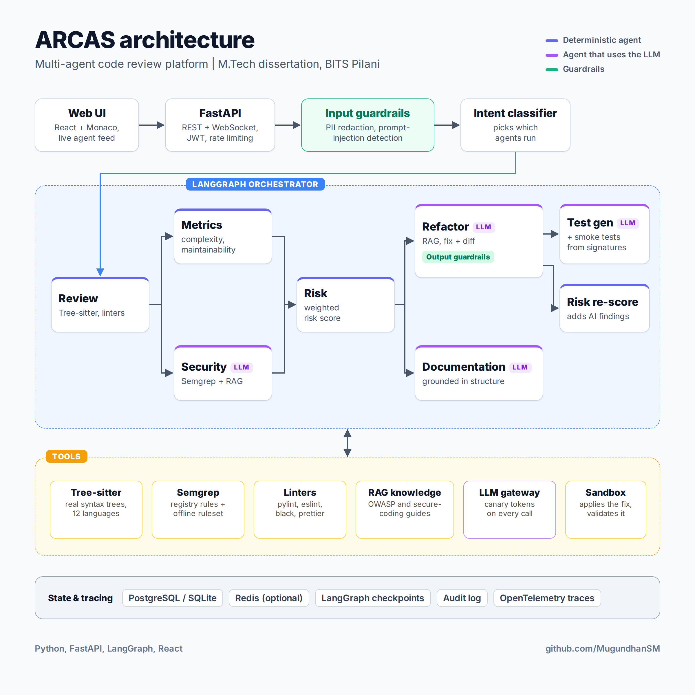

# ARCAS

**Agentic Review & Code Analysis System**, a multi-agent code reviewer.

I built ARCAS for my M.Tech (AI/ML) dissertation at BITS Pilani. You paste in some code, and a set of agents reviews it: they map its structure, score its quality, scan it for security issues, rate the overall risk, suggest fixes, write documentation and generate tests. Static analysis tools do the parts that should be exact. The LLM does the parts that need judgement, and guardrails sit on both sides of it.



It runs without an LLM too. Every agent that needs a model has a deterministic fallback, so you can try the whole pipeline locally without any API keys.

## How it works

```
React UI  ->  FastAPI  ->  input guardrails  ->  LangGraph orchestrator  ->  agents  ->  output guardrails
                                                        |
                                    Tree-sitter, Semgrep, linters, RAG, LLM
```

**Agents**

| Agent | What it does | Uses |
|-------|--------------|------|
| Review | Maps imports, classes and functions | Tree-sitter (regex fallback) |
| Metrics | Complexity, maintainability, comment density | Deterministic |
| Security | Finds vulnerabilities | Semgrep |
| Risk | Combines metrics and findings into a risk score | Weighted scoring |
| Refactor | Suggests fixes with a diff | LLM + secure-coding knowledge base (RAG) |
| Documentation | Writes developer docs | LLM |
| Test generation | Writes unit tests and runs smoke tests | LLM + signature introspection |

The orchestrator is a LangGraph graph. The request's intent decides which agents run: `full_review`, `security_audit`, `refactor`, `documentation`, `test_generation` or `metrics`. With `auto`, a classifier picks the intent. Metrics and security run in parallel.

**Guardrails**

- **Input:** rejects empty or oversized code, validates the language, redacts PII and secrets (Presidio if installed, otherwise regex recognisers), and checks for prompt injection with heuristics, similarity matching and canary tokens.
- **Output:** re-scans suggested code with Semgrep so a fix can't introduce a new vulnerability, checks that suggested Python patches still parse, optionally runs SelfCheckGPT-style consistency sampling, and returns a confidence score.

**Also included:** JWT auth (off by default), per-user rate limiting, an append-only audit log, a result cache, LangGraph checkpointing, and request tracing with OpenTelemetry.

Most heavy dependencies (Redis, ChromaDB, Presidio, pylint, OpenTelemetry) are optional. Without them, ARCAS falls back to a simpler built-in version.

## Stack

- **Backend:** Python, FastAPI, LangGraph, SQLAlchemy, PostgreSQL (SQLite fallback), Semgrep, Tree-sitter
- **Frontend:** React 18, Vite, Monaco editor
- **Infra:** Docker Compose (PostgreSQL, Redis, ChromaDB, backend, frontend)

## Running it

### With Docker

```bash
cp backend/.env.example backend/.env   # optional, see "LLM setup" below
docker compose up --build
```

- Frontend: http://localhost:3000
- API: http://localhost:8000
- API docs: http://localhost:8000/docs

### Locally

```bash
# backend
cd backend
python -m venv .venv && source .venv/bin/activate
pip install -r requirements.txt
cp .env.example .env
uvicorn app.main:app --reload --port 8000

# frontend (in another terminal)
cd frontend
npm install
npm run dev        # http://localhost:5173, proxies /api to the backend
```

If PostgreSQL isn't running, the backend falls back to a local SQLite file and logs a warning.

### LLM setup

Set these in `backend/.env`:

```
LLM_API_URL=https://your-llm-endpoint
LLM_API_KEY=your-token
```

ARCAS sends `POST {"prompt": "..."}` with a bearer token. The response can be plain text or JSON with a `response`, `text`, `content` or `output` field. Leave both values blank to run with the deterministic fallbacks.

## API

| Method | Endpoint | |
|--------|----------|--|
| POST | `/api/v1/review` | Run a review (`code`, `language`, `intent`) |
| WS | `/api/v1/review/stream` | Same, but streams progress for each stage |
| GET | `/api/v1/reviews` | List past reviews |
| GET | `/api/v1/report/{session_id}` | Full stored report |
| POST | `/api/v1/auth/register`, `/api/v1/auth/token` | Sign up and log in (JWT) |
| GET | `/api/v1/trace/{trace_id}` | Timing breakdown for a request |
| GET | `/health` | Health check and loaded capabilities |

Example:

```json
POST /api/v1/review
{
  "language": "python",
  "intent": "security_audit",
  "code": "import subprocess\nsubprocess.call(input(), shell=True)\n"
}
```

## Evaluation

`app/evaluation/` contains the benchmark I used for the dissertation: bug-detection F1, hallucination rate, guardrail recall against adversarial inputs, latency, refactoring correctness and user feedback.

```bash
cd backend
python -m app.evaluation.benchmark             # core metrics
python -m app.evaluation.benchmark --full      # everything, including external datasets
python -m app.evaluation.guardrail_eval        # guardrail recall in detail
```

CodeReviewer and SATE IV can't be redistributed. Point `ARCAS_CODEREVIEWER_PATH` and `ARCAS_SATE_PATH` at your local copies, otherwise a small bundled hand-labelled set is used and reported as such.

Semgrep's registry rules need internet access, so a set of offline rules ships in `app/knowledge/semgrep_rules/`. Set `ARCAS_SEMGREP_OFFLINE=true` to skip the registry entirely.

## Tests

```bash
cd backend
pip install -r requirements-dev.txt
pytest
```

## Project layout

```
backend/app/
  agents/          review, metrics, security, risk, refactor, docs, tests
  api/v1/          routes: review (+ websocket), reports, auth, traces
  core/            config, guardrails, PII and injection detection, auth, caching, tracing
  orchestration/   LangGraph graph, nodes, state, intent classifier
  tools/           tree-sitter, semgrep, linters, formatter, diff, retriever, LLM client
  knowledge/       secure-coding guides and semgrep rules used for RAG
  evaluation/      benchmark and datasets
  database/        models and session
frontend/src/      React app (editor, live agent feed, results, history)
```
